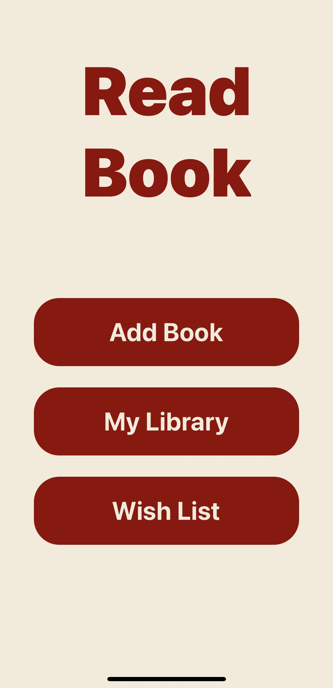
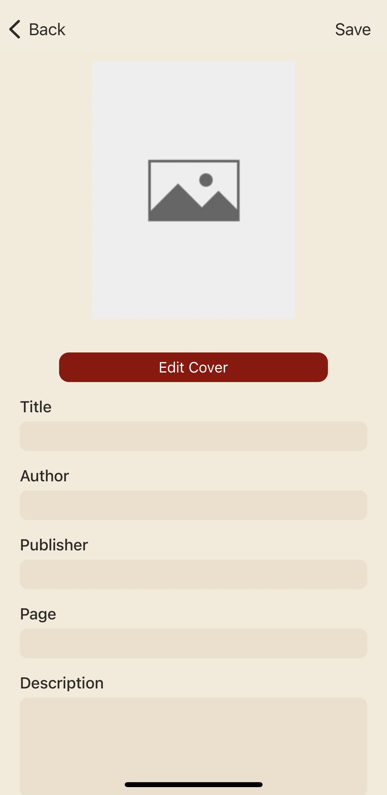
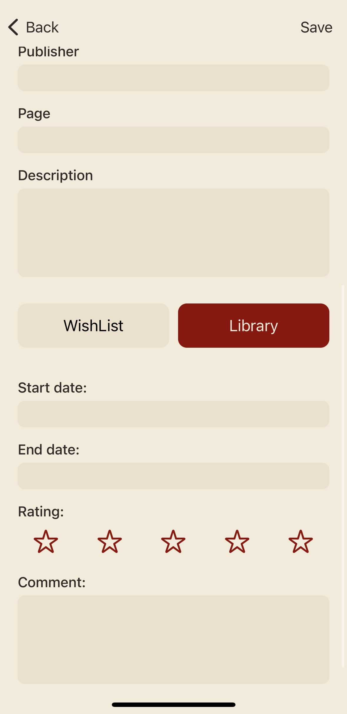
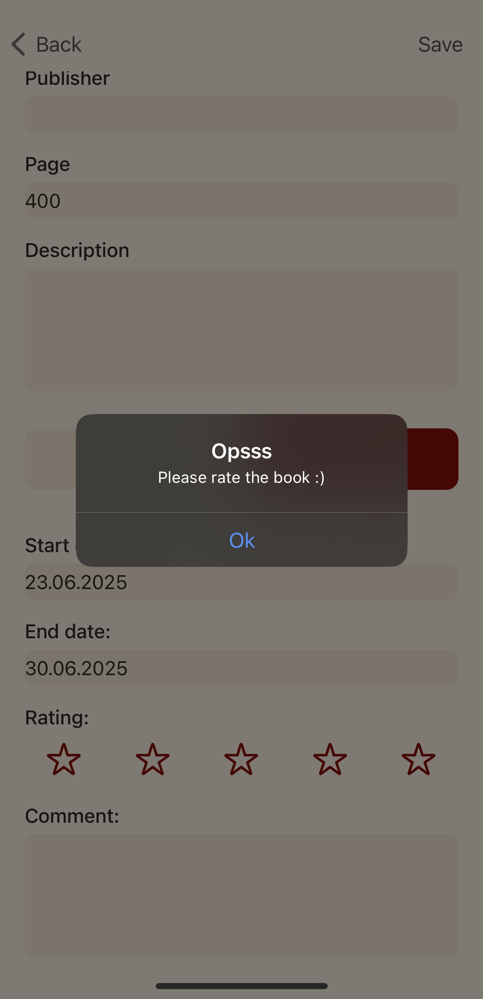
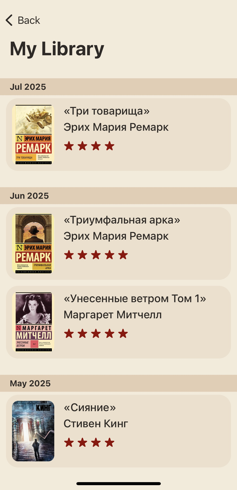
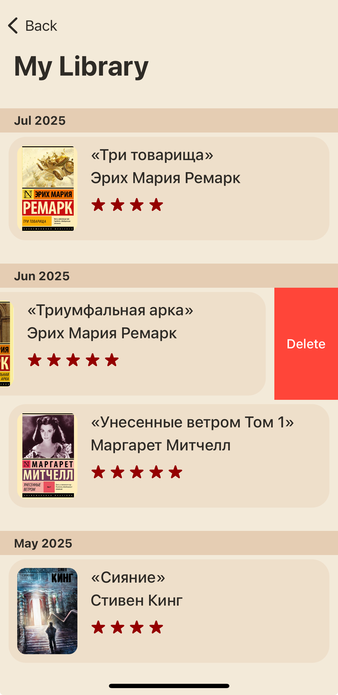
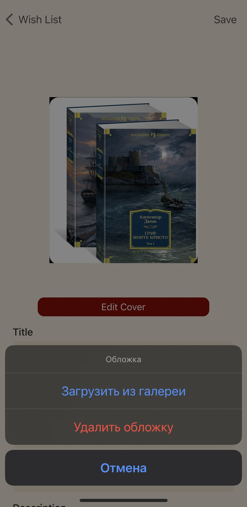
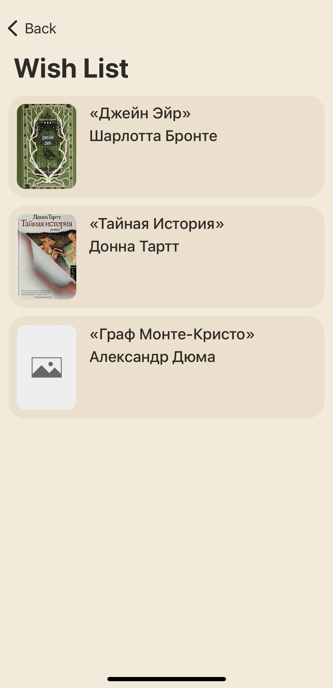

# ReadBook

ReadBook is an application for reading and organizing books. The project is implemented in Swift and Xcode. The app provides data storage for books and handles local file management. Store book information using CoreData. Save and load local files using FileManager.

## Technologies
- Swift 
- Xcode 
- UIKit 
- CoreData
- FileManager
- MVVM

## Data Storage
- **CoreData:** Stores book information such as title, author, start/end dates, rating, and comments.
- **FileManager:** Handles storing local files such as book cover images.

## Features

### Main Screen
The main screen has three buttons:
- View the Library (read books)
- View the Wishlist
- Add a new book

### Add Book
- Opens a screen to fill in book details.
- Required fields: Author and Title.
- If saving to the Library, additional required fields: End Date and Rating.
- If any required field is missing, an alert appears.
- There are two buttons to select the book category: Library or Wishlist.
  - Switching between categories hides or shows fields related to read books (Start Date, End Date, Rating, Comment).

          
### Library
- Books are displayed in a table organized by sections, where each section represents one month.
- Swipe left on a cell to delete a book from both the table and the database.
- Tap a cell to view detailed information about the book.
- Delete/Update cover
  
  
### Wishlist
- Like a library, but book are displayed in a simple table without sections.

